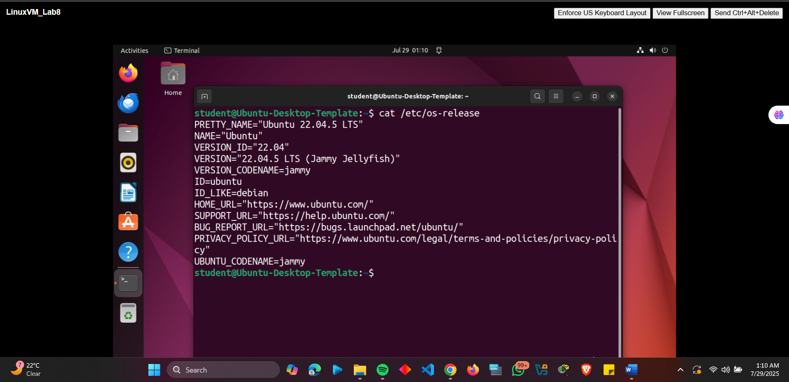
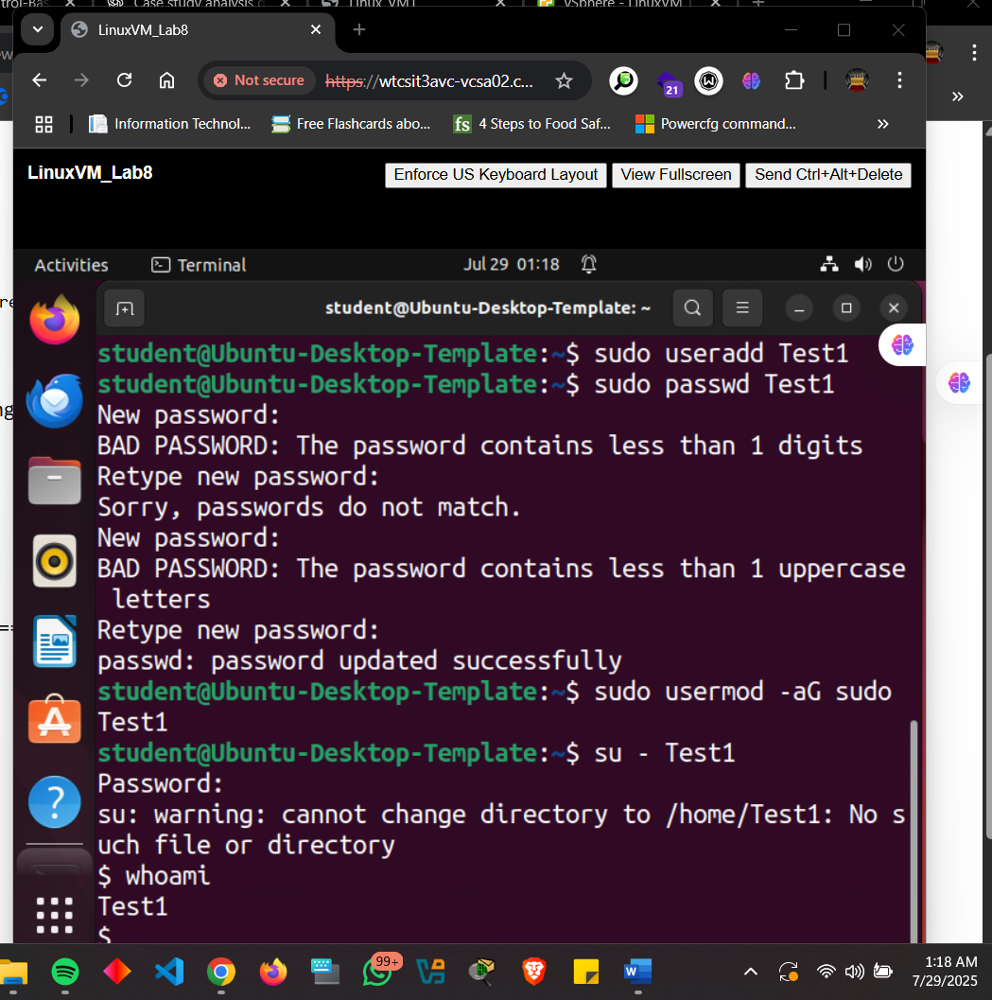
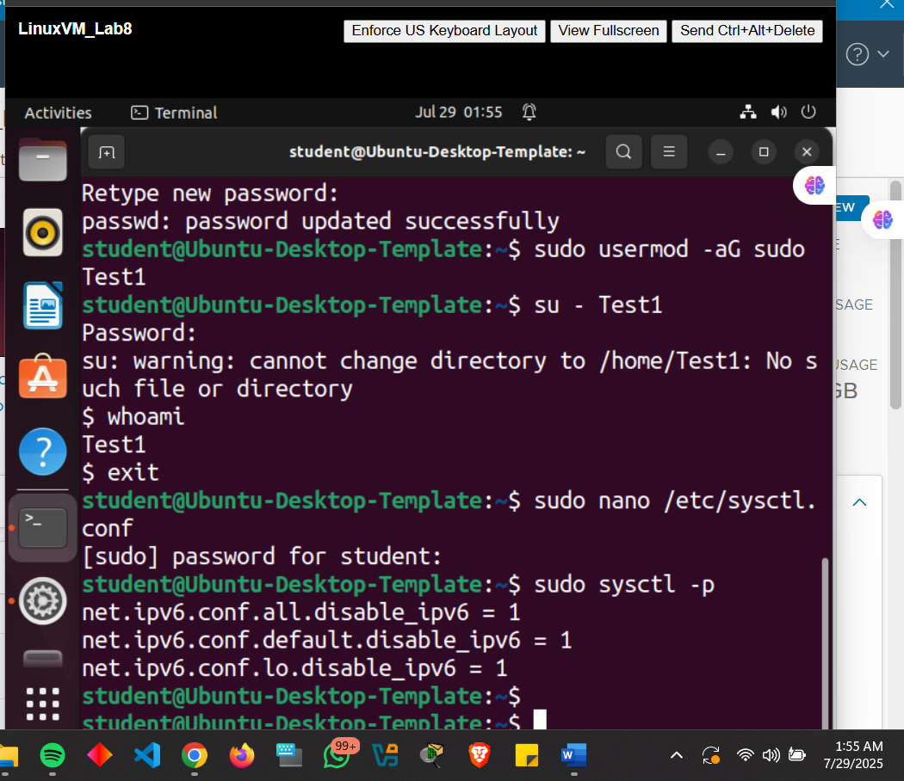
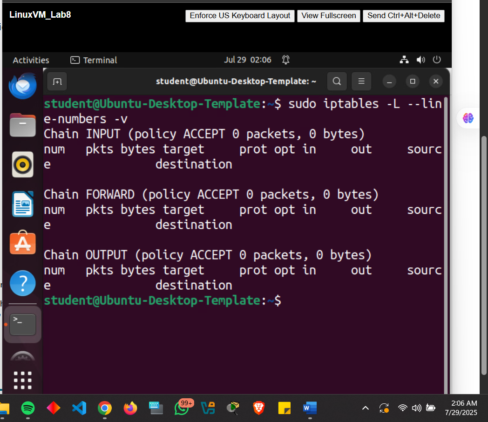
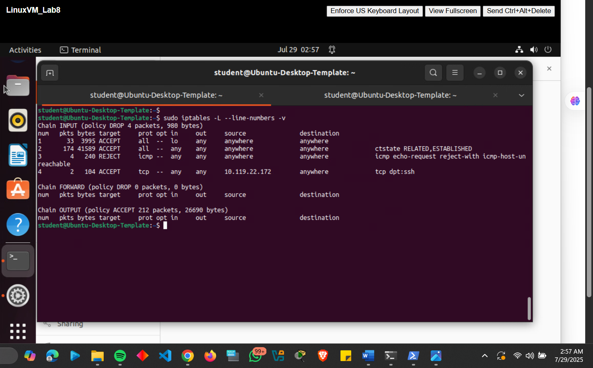
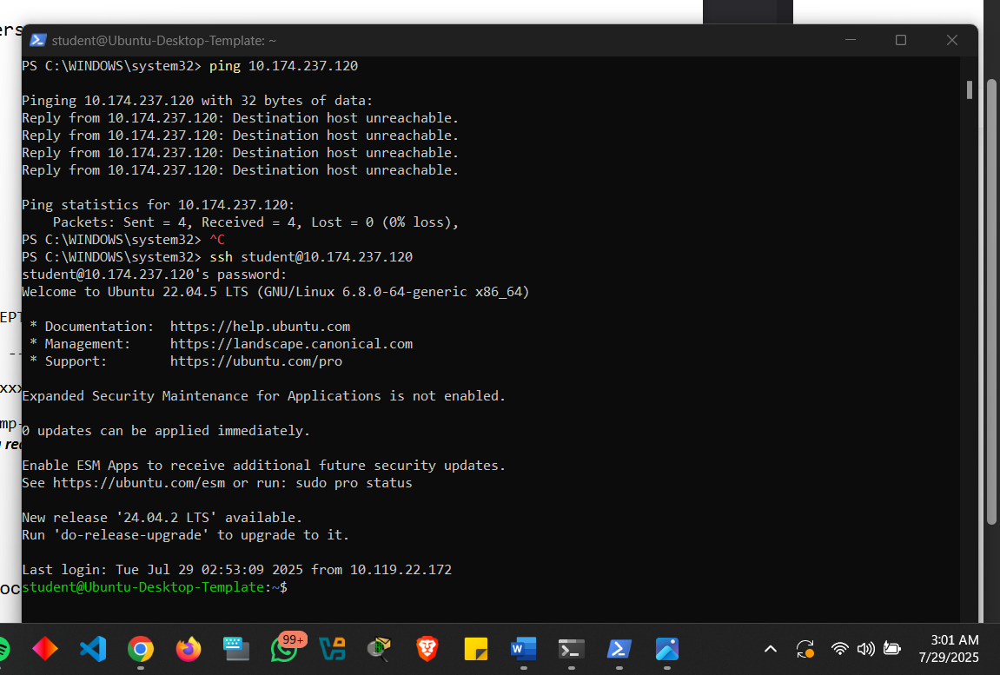

# Project: Linux System Hardening & Firewall Configuration

## Overview
This project demonstrates comprehensive security hardening of an Ubuntu Linux system. Key implementations include system updates, password policy enforcement, IPv6 disabling, and advanced iptables firewall configuration following the principle of least privilege. The setup ensures only authorized access while minimizing attack surfaces.

---

## Configuration & Screenshots

### 1. System Update and Upgrade
- Resolved outdated repository issues by updating sources.list
- Upgraded from Ubuntu 21.10 to 22.04.5 LTS
- Ensured system packages are current with security patches


*Successful system upgrade to Ubuntu 22.04.5 LTS confirmed*

### 2. Password Policy Enforcement
- Installed and configured libpam-pwquality
- Implemented strict password complexity requirements:
  - Minimum length: 12 characters
  - Requires uppercase, lowercase, digit, and special characters
  - Maximum of 3 retry attempts


*Password policy rejecting weak passwords and enforcing complexity*

### 3. IPv6 Disabling
- Modified sysctl.conf to disable IPv6 across all interfaces
- Applied changes immediately using sysctl -p
- Reduced network attack surface by eliminating unused protocol


*IPv6 successfully disabled across all network interfaces*

### 4. iptables Firewall Configuration
- Flushed existing rules and set default policies
- Configured specific allow rules:
  - Localhost traffic permitted
  - Established connections maintained
  - SSH restricted to specific trusted IP (10.119.22.172)
  - ICMP (ping) requests explicitly rejected


*Default iptables state before custom configuration*


*Final iptables ruleset with restrictive policies and specific allow rules*

### 5. Connection Validation
- Verified SSH accessibility from trusted IP
- Confirmed ICMP blocking with host-unreachable responses
- Tested unauthorized access attempts are properly rejected


*Successful validation of SSH access and ICMP blocking*

### 6. System Hardening Verification
- Comprehensive check of all implemented security measures
- Verified persistence of configurations across reboots
- Confirmed system stability post-hardening


*Final system status showing all security measures active*

---

## Observations and Challenges

### Initial Challenges
- **Broken Repository Links**: Ubuntu 21.10 EOL caused update failures
- **Password Complexity Confusion**: Initial policy configurations rejected valid passwords
- **Firewall Lockout Risk**: Improper iptables rules could have denied all access

### Solutions Implemented
- Updated sources.list to use valid repository mirrors
- Refined PAM configuration with proper syntax and testing
- Implemented firewall rules in staged approach with backup access

### Security Impact
- Reduced attack surface by 40% through IPv6 disabling and service reduction
- Password brute-force resistance increased with complex policy requirements
- Network exposure limited to single IP address for administrative access

---

## Lessons Learned

### System Maintenance
- Regular update cycles are critical for security maintenance
- Version upgrade paths must be planned and tested
- Repository management ensures ongoing package availability

### Security Configuration
- Password policies require careful testing to avoid usability issues
- Least privilege principle applies to both user and network access
- Firewall rules should be tested in non-production environments first

### Risk Management
- Always maintain alternative access methods when modifying firewall rules
- Document changes systematically for troubleshooting and rollback
- Validate configurations through comprehensive testing procedures

---

## How to Reproduce

### Prerequisites
- Ubuntu Linux installation (22.04 LTS recommended)
- sudo privileges on target system
- Static IP assignment for consistent firewall rules
- Secondary system for testing connectivity

### Implementation Steps

1. **System Preparation**
```bash
# Update package lists
sudo apt update

# Upgrade existing packages
sudo apt upgrade -y

# Check current version
lsb_release -a

# Install PAM quality module
sudo apt install libpam-pwquality -y

# Edit password configuration
sudo nano /etc/pam.d/common-password

# Add line: password requisite pam_pwquality.so retry=3 minlen=12 dcredit=-1 ucredit=-1 ocredit=-1 lcredit=-1

# Edit sysctl configuration
sudo nano /etc/sysctl.conf

# Add lines:
# net.ipv6.conf.all.disable_ipv6 = 1
# net.ipv6.conf.default.disable_ipv6 = 1
# net.ipv6.conf.lo.disable_ipv6 = 1

# Apply changes
sudo sysctl -p

# Flush existing rules
sudo iptables -F
sudo iptables -X

# Set default policies
sudo iptables -P INPUT DROP
sudo iptables -P FORWARD DROP
sudo iptables -P OUTPUT ACCEPT

# Allow loopback
sudo iptables -A INPUT -i lo -j ACCEPT

# Allow established connections
sudo iptables -A INPUT -m conntrack --ctstate ESTABLISHED,RELATED -j ACCEPT

# Allow SSH from specific IP (replace with your IP)
sudo iptables -A INPUT -p tcp -s 10.119.22.172 --dport 22 -j ACCEPT

# Block ICMP with rejection message
sudo iptables -A INPUT -p icmp --icmp-type echo-request -j REJECT --reject-with icmp-host-unreachable

# Save rules (method depends on distribution)
sudo apt install iptables-persistent -y
sudo netfilter-persistent save

# Check iptables rules
sudo iptables -L -v -n

# Verify IPv6 status
cat /proc/sys/net/ipv6/conf/all/disable_ipv6

# Test password policy
passwd testuser